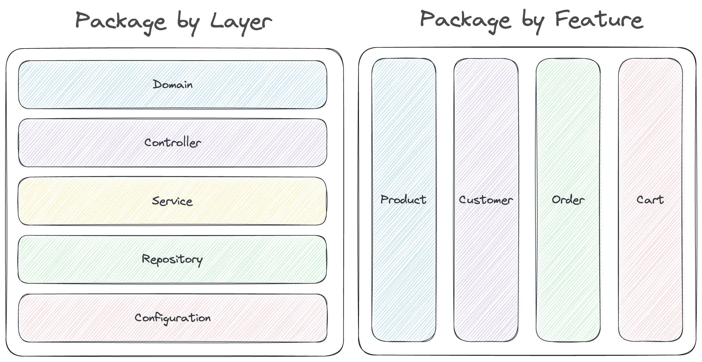

# Spring Boot Code Structure

This project is a sample project to show how to structure your code in a Spring Boot application. Spring Boot is an opinionated framework, but it does not tell you how to structure your code. This means that everything I am going through here is my opinion and you are free to disagree with me.

- No default package 
- In the same package as the main Application class (is possible) 
  - If not you will need to add `@ComponentScan(basePackages = {"dev.danvega.post", "dev.danvega.codestructure"})`
- Organizing your code
  - Package by Layer
  - Package by Feature
    - [Package by Layer vs Package by Feature](https://medium.com/sahibinden-technology/package-by-layer-vs-package-by-feature-7e89cde2ae3a)
    - [Java Practices](http://www.javapractices.com/topic/TopicAction.do?Id=205)
  - [Hexagonal architecture](https://reflectoring.io/spring-hexagonal/) / Onion Architecture 
  - [Spring Modulith](https://spring.io/projects/spring-modulith)

## Software Design Principles

**Cohesion** represents the relationship within a module. 
**Coupling** represents the relationships between modules. 

Good (loose coupling, high cohesion)
Bad (high coupling, low cohesion)

**Encapsulation** 

In software systems, encapsulation refers to the bundling of data with the mechanisms or methods that operate on the data. 
It may also refer to the limiting of direct access to some of that data, such as an object's components.
  
## Package by Layer

- Promotes Best Practice (❌)
  - Low cohesion
  - High coupling
  - Low modularity
- Encapsulation (❌)
  - Most classes must be public
- Modularity (❌)
  - Since each layer is limited to classes related to a particular layer, it is difficult to break code down into a microservice later on.
- Maintainability (❌)
  - Since classes are scattered across packages, it is difficult to find the class you are looking for.
- Testability (❌)
  - Since classes are public, they can be accessed by tests in any package. This allows you to write less focused tests.

## Package by Feature

- Promotes Best Practices
  - High cohesion
  - Low coupling
  - High modularity
- Encapsulation (Minimize Scope)
  - Allows some classes to set their access modifier package-private instead of public.
- Modularity
  - Since each package is limited to classes related to a particular feature, it is easy to break code down into a microservice later on.
- Maintainability
  - Reduces the need to navigate between packages since all classes needed for a feature are in the same package.
- Testability
  - Since classes are not public, they can only be accessed by tests in the same package. This allows you to write more focused tests.

## Package by Feature & Package by Layer

I have seen that some prefer to break down their project by feature but then add a layer in each feature package. I think this is going to 
be a little bit of extra work and still have the side affects of package by layer.